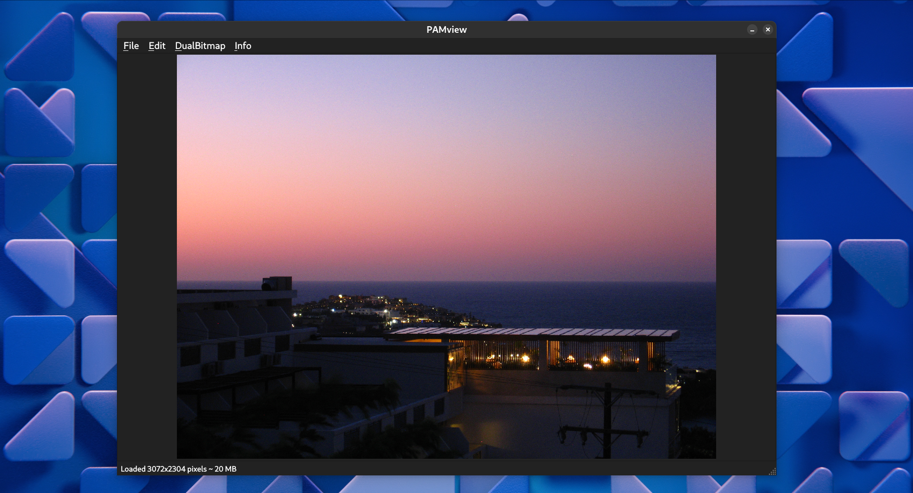

# PamView
PamView is a simple PAM (Portable Anymap) image viewer and editor, powered by Qt and C++



## Features

### Opening files
Support for all variants (`.pbm`, `.pgm`, `.ppm`), that means `P1` to `P6` variants. Both raw and ASCII

### Saving files
Support for both raw and ASCII `.ppm` (`P3` and `P6`) variants.

### Dual bitmap
You can have two bitmaps open at once, and cycle between them.

### Image manipulation
The following effects can be applied:

- brightness
- saturation
- grayscale
- black and white
- negative

The following image combinations can be applied:

- sum
- difference
- product

### More features
Also worth noting:

- undo button
- bitmap properties
- memory allocation display
- image zoom and panning

## Compilation

### Prerequisities
- CMake and a C++ compiler
- Qt 6

### Steps to build
1. Navigate to the root project directory
2. Create an empty `build` directory
3. Navigate to the `build` directory
4. Set the Release configuration:

    ```
    cmake .. -DCMAKE_BUILD_TYPE=Release
    ```
5. Build the project:
    ```
    cmake --build .
    ```
5. Start the executable, located under `build/frontend/pamview` (`.exe` on Windows)

